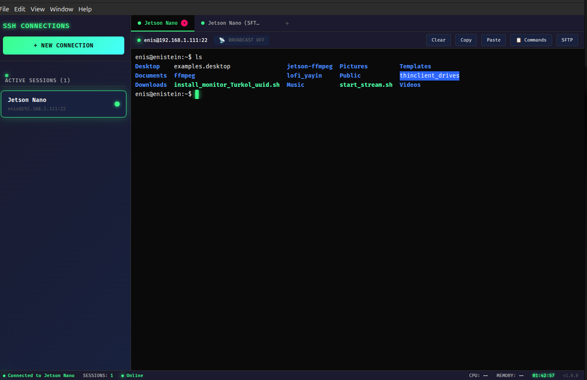

# 🚀 KEMENT - Modern SSH Terminal

<div align="center">


**A comprehensive SSH client for Linux systems**

[](https://opensource.org/licenses/MIT)
[](https://electronjs.org/)
[](https://nodejs.org/)
[](https://reactjs.org/)

</div>

## 📋 Overview

KEMENT is a feature-rich SSH terminal designed as a modern alternative to MobaXterm for Linux systems. Built with Electron and React, it combines the power of real SSH connections with an intuitive interface.

### ✨ Key Features

- **🖥️ Multi-Terminal Management**: Open multiple SSH sessions in tabs with session persistence
- **📁 Dual-Pane SFTP Browser**: Seamless file transfer between local and remote systems
- **📡 Broadcast Commands**: Send commands to all active terminals simultaneously
- **💾 Saved Commands**: Store and quickly execute frequently used commands
- **🎨 Modern Theme**: Dark theme with clean design
- **🔐 Secure Authentication**: Support for password and SSH key authentication
- **⚡ Real-Time Terminal**: Full SSH shell integration with real command execution
- **🔄 Session Persistence**: SSH sessions remain active during tab switching

## 🎥 Screenshots

### Main Interface

*SSH Terminal with modern theme and multiple connection profiles*

### New Connection Dialog

*Easy connection setup with form validation and testing*

### SFTP File Browser

*Dual-pane file manager with local and remote file browsing*

### SSH Terminal

*Real SSH terminal with command execution and output streaming*

## 🚀 Quick Start

### Prerequisites

- **Node.js** 16.0 or higher
- **npm** 8.0 or higher  
- **Linux** operating system (Ubuntu, Debian, Fedora, etc.)

### Installation

1. **Clone the repository**
   ```bash
   git clone https://github.com/enisgetmez/Kement.git
   cd kement
   ```

2. **Install dependencies**
   ```bash
   npm install
   ```

3. **Build the application**
   ```bash
   npm run build
   ```

4. **Start the application**
   ```bash
   npm start
   ```

### Download AppImage (Recommended)

For easy installation, download the pre-built AppImage:

1. **Download** the latest [KEMENT-1.0.0.AppImage](https://github.com/enisgetmez/Kement/releases/latest)
2. **Make executable**: `chmod +x KEMENT-1.0.0.AppImage`
3. **Run**: `./KEMENT-1.0.0.AppImage`

No installation required - runs on any Linux distribution!

### Building for Distribution

To create a distributable package:

```bash
npm run dist
```

This creates an AppImage file in the `build/` directory that can be run on any Linux system.

## 💡 Usage Guide

### Creating SSH Connections

1. **Open Connection Form**: Click the "+" button in the sidebar
2. **Fill Connection Details**:
   - **Name**: Friendly name for your connection
   - **Hostname**: Server IP address or domain name
   - **Port**: SSH port (default: 22)
   - **Username**: SSH username
   - **Password**: SSH password or leave blank for key authentication
   - **Private Key**: Path to SSH private key file (optional)
3. **Test Connection**: Click "Test Connection" to verify settings
4. **Save**: Click "Save" to store the connection profile

### Using the Terminal

- **Connect**: Double-click a saved connection to open a new SSH terminal
- **Multiple Sessions**: Each connection opens in a new tab
- **Command History**: Use Up/Down arrows for command history
- **Copy/Paste**: Right-click for context menu or use Ctrl+Shift+C/V

### SFTP File Browser

- **Access**: Click the SFTP tab after connecting to a server
- **Navigate**: Double-click folders to browse directories
- **Address Bar**: Type paths directly and press Enter
- **File Transfer**: Drag files between local and remote panes
- **File Operations**: Right-click for context menu (download, upload, delete, etc.)

### Advanced Features

#### Broadcast Commands
1. Enable broadcast mode using the broadcast button in toolbar
2. Commands typed in any terminal will be sent to all active sessions
3. Useful for multi-server administration tasks

#### Saved Commands
1. Click the "Saved Commands" panel in any terminal
2. Add frequently used commands with custom names
3. Execute saved commands with a single click
4. Commands are persistent across application restarts

## 🔧 Development

### Project Structure

```
kement/
├── src/                    # React frontend source
│   ├── components/         # React components
│   ├── services/          # Service classes
│   └── styles/            # CSS and theme files
├── main.js                # Electron main process
├── webpack.config.js      # Webpack configuration
├── package.json           # Project dependencies
└── assets/                # Static assets (icons, images)
```

### Development Commands

```bash
# Start development with hot reload
npm run dev

# Build for production
npm run build

# Start the application
npm start

# Package for distribution
npm run dist

# Clean build artifacts
npm run clean
```

### Key Technologies

- **Frontend**: React 19.1+ with Styled Components
- **Desktop Framework**: Electron 38.2.0
- **SSH Client**: ssh2 library for real SSH connections
- **SFTP**: ssh2-sftp-client for file operations
- **Terminal**: @xterm/xterm for terminal emulation
- **Storage**: electron-store for persistent data

### Architecture

KEMENT uses a multi-process architecture:

- **Main Process** (`main.js`): Handles SSH connections, SFTP operations, and system integration
- **Renderer Process** (`src/`): React-based UI with terminal emulation and file browser
- **IPC Communication**: Secure communication between processes for SSH operations

## 🛠️ Configuration

### SSH Key Authentication

1. Generate SSH key pair:
   ```bash
      ssh-keygen -t rsa -b 4096 -C "enis@enisgetmez.com"
   ```

2. Copy public key to server:
   ```bash
   ssh-copy-id user@hostname
   ```

3. In KEMENT, specify the private key path in connection settings

### Customization

- **Theme Colors**: Modify CSS variables in `src/styles/`
- **Default Settings**: Update `src/services/ConnectionManager.js`
- **Window Properties**: Adjust `main.js` BrowserWindow configuration

## 🔒 Security

KEMENT takes security seriously:

- **Local Storage**: All connection data stored locally with electron-store
- **Password Handling**: Passwords encrypted at rest
- **SSH Keys**: Support for encrypted private keys
- **No Data Collection**: No telemetry or usage data sent to external servers

## 🤝 Contributing

Contributions are welcome! Please follow these steps:

1. Fork the repository
2. Create a feature branch (`git checkout -b feature/AmazingFeature`)
3. Commit your changes (`git commit -m 'Add some AmazingFeature'`)
4. Push to the branch (`git push origin feature/AmazingFeature`)
5. Open a Pull Request

### Development Guidelines

- Follow React best practices and hooks patterns
- Use styled-components for component styling
- Add comprehensive error handling for SSH operations
- Write clear commit messages and documentation
- Test on multiple Linux distributions

## 🐛 Troubleshooting

### Common Issues

**Connection Timeout**
- Check firewall settings and SSH port accessibility
- Verify server hostname and credentials
- Ensure SSH service is running on target server

**SFTP Not Working**
- Confirm SFTP subsystem is enabled on SSH server
- Check file permissions and user access rights
- Verify network connectivity and port 22 access

**Application Won't Start**
- Check Node.js version (requires 16.0+)
- Run `npm install` to update dependencies
- Check console output for specific error messages

**Performance Issues**
- Close unused SSH sessions to free memory
- Limit concurrent file transfers
- Check system resources and available RAM

### Debugging

Enable debug mode for detailed logging:

```bash
NODE_ENV=development npm start
```

This opens developer tools with console logging for troubleshooting.

## 📄 License

This project is licensed under the MIT License - see the [LICENSE](LICENSE) file for details.

## 👥 Acknowledgments

- **SSH2 Library**: For robust SSH client functionality
- **Xterm.js**: For excellent terminal emulation
- **Electron Team**: For the cross-platform desktop framework
- **React Team**: For the powerful frontend framework

## 📮 Support

For support, feature requests, or bug reports:

- **GitHub Issues**: [Create an issue](https://github.com/enisgetmez/Kement/issues)
- **Email**: enis@enisgetmez.com
- **Documentation**: Check this README and inline code comments

---

<div align="center">

**Made with ❤️ by Enis**

*Empowering system administrators and developers with modern SSH tooling*

</div>